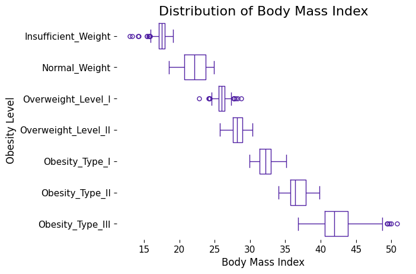

# Obesity Levels Model
## Abstract
This project aims to develop a Machine Learning (ML) model to predict the level of obesity based on a person's health and fitness factors. It also performs an Exploratory Data Analysis (EDA) in order to generate useful information and insights about the relationships of the factors that impact the obesity of an individual.

## Author, Affiliation and Contact
Alexis Aguilar [Student of Bachelor's Degree in "Tecnologías para la Información en Ciencias" at Universidad Nacional Autónoma de México [UNAM](https://www.unam.mx/)]: alexis.uaguilaru@gmail.com

This repository is not affiliated or related to academic or professional purposes. Repository for personal project.

## License
Project under [MIT License](LICENSE)

## Introduction
[[2]](#references) Overweight and obesity are two conditions that threaten health and in recent years and decades there has been an increase in the percentage of people who suffer from them, mainly among children and adolescents, thus becoming an alarming problem worldwide because being overweight or obese carries with it the risk of having other conditions and disorders such as cardiopathic or musculoskeletal.

[[2]](#references) Prevention and medical control allow both reversing and reducing the complications associated with overweight and obesity. For this reason, it is also important to know the patient's condition in order to determine the best actions to help him/her have a better quality of life.

## Dataset Overview
[[1]](#references) This dataset include data for the estimation of obesity levels in individuals from the countries of Mexico, Peru and Colombia, based on their eating habits and physical condition. The data contains 17 attributes and 2111 records, the records are labeled with the class variable NObesity (Obesity Level), that allows classification of the data using the values of Insufficient Weight, Normal Weight, Overweight Level I, Overweight Level II, Obesity Type I, Obesity Type II and Obesity Type III.

## Exploratory Data Analysis
A more detailed breakdown of the EDA procedure can be found in [Jupyter](./ExploratoryDataAnalysis/ExploratoryDataAnalysis.ipynb) or [Marimo](./ExploratoryDataAnalysis/ExploratoryDataAnalysis.py) notebooks.

First, a univariate analysis of some of the features relevant to obesity is performed, being Body Mass Index (BMI) the feature that has the greatest weight to determine the obesity condition of an individual. This is because it is the main criterion used to evaluate a person, but it is not the only one because there are other factors.

Since obesity levels are defined by BMI (there are ranges of BMI values to determine a person's obesity), using this feature generates a good separation between levels by definition, but when considering other information these start to become blurred because weight and height are not the only factors to determine the physical condition of an individual.

A Factor Analysis shows that having overweight family members also influences a person's obesity, which can be explained by the main habits shared with family members. Therefore, it could be concluded that there are external factors that determine certain health conditions of a person.

This phenomenon can be illustrated by considering two families that have totally opposite habits, one is healthy (they exercise and have a balanced diet) and the other is sedentary. The children of these families will illustrate the habits of their parents, thus causing the children of the first family to be healthy and at their ideal weight, while those of the second family tend to be overweight.

From the EDA it is concluded that overweight and obesity are conditions that can not only be classified based on one factor or metric, but that there are others that allow us to better define the specific condition of an individual. The use of information regarding BMI and family history of overweight allows a good description of the level of obesity of a person, but if their physical activity and eating habits are added, this level and the recommendations to improve the quality of life of the individual can be specified.

## Models
In the notebooks named `MachineLearning.*` and `NeuralNetwork.*` found in [Models](./Models/), both in their Jupyter and Marimo versions, the procedure and decisions made for the definition (creation), training, and selection of the models are further developed.

First, the entire dataset was divided into train, evaluation, and test using $64\%$, $16\%$, and $20\%$ of the instances, respectively, for each dataset. This procedure can be found in [SplitDataset.py](./Models/SplitDataset.py).

For the ML models, [scikit-learn classifiers](https://scikit-learn.org/stable/supervised_learning.html) were used, specifically: Logistic Regression, Random Forest, Support Vector Machine, and AdaBoost. These models were chosen to generate diversity in ML classification techniques and methods and to create a more robust comparison between the results generated.

Optuna was used for fine-tuning of hyperparameters of the ML models, which yielded good results and evaluations using the F1 metric (with scores greater than $0.9$), used due to the imbalance in the dataset shown in [Exploratory Data Analysis](#exploratory-data-analysis).

PyTorch functionalities and classes were used for the neural network (model NN). Small topologies (architectures) with few layers and neurons were chosen in order to achieve higher quality training, given that the instances for this were limited. This procedure achieved evaluation scores (using the F1 metric) comparable to those obtained by ML models.

## Technologies
* [Python](https://www.python.org/)
  * [marimo](https://marimo.io/)
  * [jupyter](https://jupyter.org/)
  * [pandas](https://pandas.pydata.org/)
  * [NumPy](https://numpy.org/)
  * [seaborn](https://seaborn.pydata.org/)
  * [SciPy](https://scipy.org/)
  * [statsmodels](https://www.statsmodels.org/stable/index.html)
  * [scikit-learn](https://scikit-learn.org/stable/)
  * [PyTorch](https://pytorch.org/)
  * [Optuna](https://optuna.org/)

## References
- [1] Estimation of Obesity Levels Based On Eating Habits and Physical Condition, UCI Machine Learning Repository, DOI: https://doi.org/10.24432/C5H31Z, 2019.
- [2] Obesity, WHO. https://www.who.int/health-topics/obesity